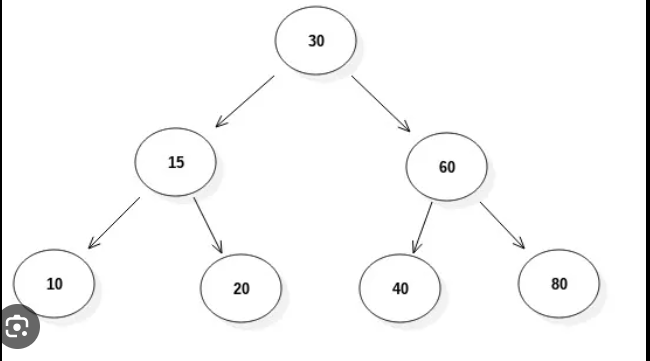
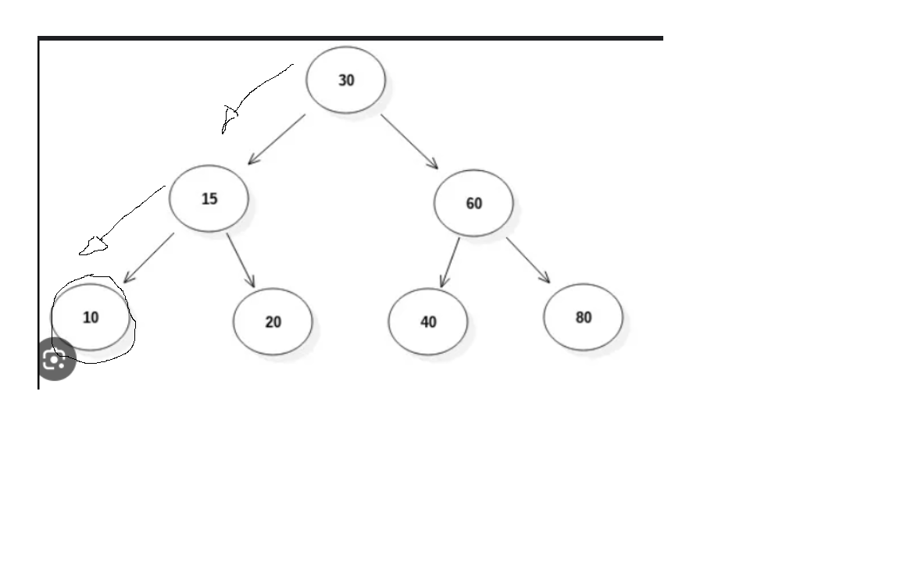
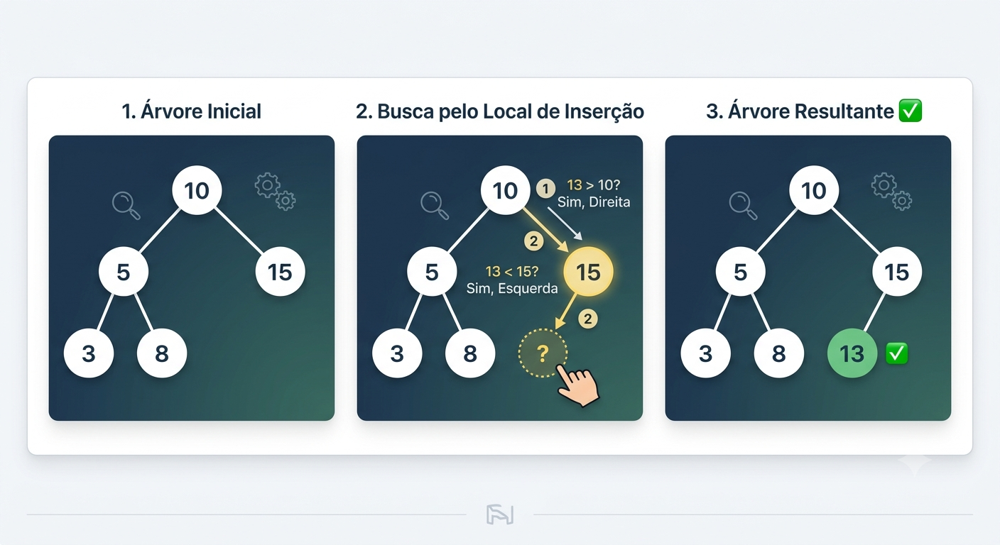
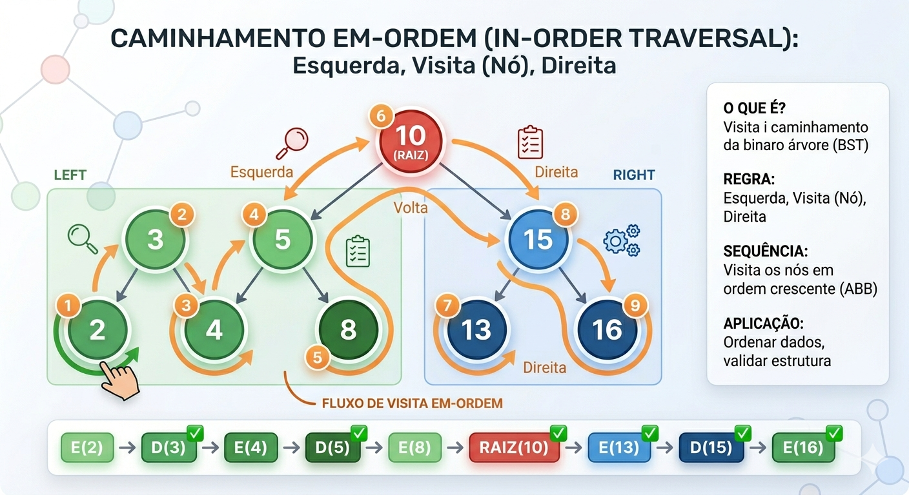
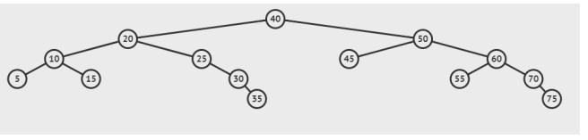

## Documentação Geral ABB
Vamos documentar todas as funcões aqui com imagems e explicações logicas para o codigo não ficar muito confuso

## Estrutura ABB

-*Arvore binaria de busca:*
-
é uma arvore onde cada no pode ter no entre 0 ou 2 filhos

os filhos do seus no são ditos por filhos a esquerda e filhos a direita.

os elementos da direita são menores que os elemntos da direita

Caso Médio: \(O(\log n)\) para busca, inserção e remoção. É extremamente eficiente para grandes volumes de dados.

Pior Caso: \(O(n)\) se a árvore se tornar "degenerada" (linear, parecendo uma lista encadeada), o que acontece quando os dados são inseridos já ordenados.

Classe ABB:Nela vc tem acesso a uma referencia para a Raiz da arvore

agora vamos para as prinicpais funcionalizades da classe ABB:

Criar uma arvore vazia

localizar um registro na arvore

inserir um novo registro na arvore

remover um registro na arvore

caminhar na arvore imprimindo os itens dos registros armazenados

--------------------

## Funcão vazia
public Boolean vazia() {
return (this.raiz == null);
}

retorna verdadeiro se a arvore estiver vazia e falso se estiver com alguma coisa

----------------

## Pesquisar
Por ser uma arvore binaria de busca o seu pesquisar e igual o da pesquisa binaria em que nos vamos descartando cadametade da arvore ao ir tomando conhecimento da arvore de maior em menor numero,utilizaremos recursão

Inicia-se a pesquisa pela raiz da arvore

Se a raiz atual for igual ao item procurado retornamos o item e concluimos que a pesquisa foi feita com sucesso

if (raizAtual.getItem == item)
// O item procurado foi encontrado.
return raizArvore.getItem();

--Caso contrario nos comparamos a raiz atual com o item procurado

-Se o item procurado for MAIOR que o numero da raiz,significa que temos que procurar na DIREITA,então seguimos a busca pela DIREITA e chamamos a função pesquisar so que passando o parametro ArvoreRaiz.getDireita(),ficaria assim:

else if (Item >raizAtual.getItem())
return pesquisar(raizArvore.getDireita(), procurado);

-Se o item procurado for MENOR que o numero da raiz,significa que temos que procurar na ESQUERDA,então seguimos a busca pela ESQUERDA,e chamamos a função pesquisar so que passando o parametro ArvoreRaiz.getEsquerda,ficaria assim:

else if (Item <raizAtual.getItem())
return pesquisar(raizArvore.getEsquerda(), procurado);

Caso o item não esteja na arvore nos vamos receber a referencia NULL e lançamos uma excessão

if (raizArvore == null)
// Se a raiz da árvore ou sub-árvore for null, a árvore está vazia e então o item não foi encontrado.
throw new NoSuchElementException("O item não foi localizado na árvore!");

Então concluimos que uma hora por questões recursivas vamos ou achar o numero procurado e RETORNA ELE(ItemProcurado) ou vamos cair na EXCESSÃO.

Para melhor entendimento vamos  usar imagens

Pesquisar(10)

Primeiro começamos a busca pelo Raiz no caso seria o 30 verifcamos se o (30==ItemProcurado) no caso não é então verificamos se ele 10(Nosso elemento procurado) é MAIOR ou MENOR do que o 30,nesse caso e MENOR então continuamos nossa busca pela esquerda,e repetimos o processo

Comparamos o elemento procurado com a raiz se o 10==15 nesse caso não é então avançamos na nossa arvore,mas temos que saber se sera para a direita ou para edquerda então nos comparamos denovo se ele 10(Nosso elemento procurado) é MAIOR ou MENOR do que o 15,nesse caso e MENOR então continuamos nossa busca pela esquerda,e repetimos o processo

Comparamos novamente se o elemento procurado e igual a raiz se 10==10 nesse caso é verdadeiro e retornamos o elemento e concluimos uma busca com sucesso

Melhor Caso / Caso Médio: \(O(\log n)\)Se a árvore estiver bem balanceada (com os lados esquerdo e direito com alturas similares), o algoritmo corta metade das possibilidades a cada passo, funcionando de forma idêntica à pesquisa binária.

Pior Caso: \(O(n)\)Se os elementos forem inseridos em ordem (ex: 10, 20, 30, 40), a árvore vira uma linha reta para a direita. Nesse cenário, ela se comporta como uma lista encadeada simples, perdendo toda a vantagem da estrutura de árvore.

----------------------

## ADICIONAR

Agora vamos adicionar um item na arvore,eh bem similar a busca binaria,SEMPRE VAMOS ADICIONAR ONDE A POSIÇÃO É *NULL* Então nos vamos rodar a arovore todas perguntando se o nosso intem que nos queremos adicionar é maior ou menor que o item que  esta no nó da arvore,caso for maior vamos pra direita,caso nosso item for menor vamos para esquerda

Nesse exemplo agora vamos adicionar o 13
   

percebe se que no começo procuramos o local certo para a inserção
achamos o local que é a esquerda do 15 ja que 13 é maior do que 10 e menor do que 15
agora nos verficamos se tem açguma coisa então temos que garantir que não tem nenhum filho a esquerda do 15 e inserimos o 13,para inserir fazemos um setItem no No dele

Inserção sempre nas Folhas: Um novo elemento sempre será inserido como um novo nó folha (no final de algum caminho da árvore). O algoritmo nunca substitui ou "empurra" um nó existente para baixo durante a inserção simples; ele apenas encontra o primeiro espaço vazio (null) válido.

Caso Médio / Melhor Caso: $O(\log n)$Se a árvore estiver balanceada (como na imagem), o tempo de busca é logarítmico. A cada decisão (esquerda ou direita), você descarta metade dos nós restantes.

Pior Caso: $O(n)$Se os dados forem inseridos já ordenados (ex: 1, 2, 3, 4, 5), a árvore se torna "degenerada" (parecida com uma lista encadeada). Nesse cenário, a árvore perde sua eficiência, pois a altura $h$ fica igual ao número de nós $n$.

----------------------------------

## CAMINHAMENTO
Para nos percorremos a arvore e printar ela(por completa)nos temos tres modos diferentes,caminhamentos pré ordem,em ordem e pós ordem
para a gente fazer esse caminhamentos vamos usar principalemnte a RECURSÃO
Formula para saber o numero de chamadas:2n+1
Temos que verificar se a raiz é diferente de NULL

**Caminhamento PRÉ ORDEM**
Nesse tipo de caminhamento voce começa imprimindo a raiz depois as diversas subarvores
O melhor caminhamneto para entender as posições da arvore
A raiz sempre vem primiero por isso chama PRÉ ordem,a raiz vem antes
Se voce salvar a saida e reconstruir a arvore na ordem que saiu vocé terá a arvore originl de volta

*Ordem do  caminhamneto pré ordem é nessa ordem:

-Raiz

-Esquerda

-Direita

**CODIGO**

public void caminhamentoPreOrdem(No <E> raizArvore){
//verificamos se esta vazia
if(raizArvore!=null){
   System.out.println(raizArvore.getItem());      //RAIZ
   caminhamentoPreOrdem(raizArvore.getEsquerda());//ESQUERDA
   caminhamentoPreOrdem(raizArvore.getDireita()); //DIREITA
 }
}

Para saber melhor esse CaminhamentoPreOrdem fiz um MACETE:primeiro emprimimos a raiz da arvore,depois todos os elementos a sua esquerda,e como se vc desse um getesquerda e ja printasse,e depois nesse mesma subarvore da esquerda quando acabar de imprimir toda a esquerda imprima os elementos da direita da subarvore da esquerda subindo,depois disso vamos para a subarvore da direita,nela vamos imprimir,todos os ekekmntos da esquerda dessa subarvore a direita da nossa raiz principal e depois imprimimos os da direta subindo

EX:Uma arvore 10,5,15,3,8,13,16,2,4

            _______[10]_______
            /                  \
       __[5]__              _[15]_
      /       \            /      \
    _[3]_       [8]      [13]    [16]
    /   \
  [2]   [4]

Imprimimos a raiz:10

--Vamos para a subarvore a esquerda do 20--

Imprimimos toda a esquerda:5,3,2

Agora pegamos a direita subindo(De baixo para cima):4,8

--Agora vamos para a subarvore a direita do 10---

Imprimimos toda a sua esq(Maiz primiero imprimimos a subarvore dessa raiz(15)):15,13

Agora imprimimos os elementos da direita subindo(De baixo para cima):16

--Agora Juntamos tudo fica:--

10,5,3,2,4,8,15,13,16

**CAMINHAMENTO EM ORDEM**
Impressão dos elementos da arvore do menor para o menor
Nesse tipo de caminhamento começamos pela Subarvore da esquerda e depois emprimos a raiz e depois a subarvore da diretia

Então sua orde de caminhamento é essa:

-Visita SubArvore da esquerda;

-Printa a raiz;

-Visita SubArvore da direita;

**CODIGO**

public void caminhamentoEmOrdem(No <E> raizArvore){
caminhamnetoEmOrdem(raizArvore.getEsquerda());
System.out.println(raizArvore.getItem());
caminhamentoEmOrdem(raizArvore.getDireita());
}

//  Caminhamento Em-Ordem: Esquerda -> Raiz -> Direita
  Resultado esperado: [2, 3, 4, 5, 8, 10, 13, 15, 16]

            _______[10]_______           <- 6° (Visita a Raiz Geral)
           /                  \
       __[5]__              _[15]_       
      /       \            /      \
    [3]       [8]        [13]    [16]    
    / \       /           /        \     
   [2] [4]   (Fim)       (Fim)    (Fim) 

2 na esquerda do 3 

4 na direita do 3

//  Ordem exata dos passos:

//  1º: [2] -> 2º: [3] -> 3º: [4] -> 4º: [5] -> 5º: [8] -> 6º: [10] -> 7º: [13] -> 8º: [15] -> 9º: [16]

DICA:Caso quiser trocar a ordem de impressão,ou seja imprimir os maiores e depois os menores e so trocar no codigo as chamas então fica:

public void caminhamentoEmOrdem(No <E> raizArvore){
caminhamentoEmOrdem(raizArvore.getDireita());
System.out.println(raizArvore.getItem());
caminhamnetoEmOrdem(raizArvore.getEsquerda());
}

**CAMINHAMENTO PÓS ORDEM**
Nesse caminhamento nos visitamos a raiz por ultimo
primeiro vamos pea esquerda na sua raiz mais profunda,depois a direita mais profunda tbm e depois subimos até a raiz

nesse exemplo veja o macete que eu desenvolvi:
primeiro emprimimos a esquerda e a direita da arvoer começando de baixo para cima e quando chega na raiz principal da arvore pulamos ela e vamos para o ourto lado repetindo o processo so que descendo agora,ent emprimimos a esquerda descendo na subarvoer das direita e depois os elementos da direita subindo

acompanhe no exemplo fica:5,15,10---ate agora pegamos esq(5),15(dir),10 raiz

agora nos pulamos a raiz dessa nossa subarvore e pegamos o elemnto mais a esquerda,como n tem nos vamos pelo elelemntos da direita começando de baixo para cima

entao fica:35,30,25

agora que ja emprimimos toda a subarvoer da esq menos a raiz podemos emprimir  a raiz

raiz,subarovore esq-20

agora vamos para a subarvore da direita mas aqui a gente da uma mudada,nos emprimimos os elemntros da esquerda descendo 

entao fica:45,55

depois por a gente ja esta no fundo emprimimos os elelmntos da direito do fundo para o topo

entao fica:75,70,60

agora a subarover raiz da direita 50

e por ultimo a raiz da subarvore 40

**CODIGO**

public void caminhamentoPreOrdem(No <E> raizArvore){
caminhamnetoPreOrdem(raizArvore.getEsquerda());
caminhamentoPreOrdem(raizArvore.getDireita());
System.out.println(raizArvore.getItem());
}

